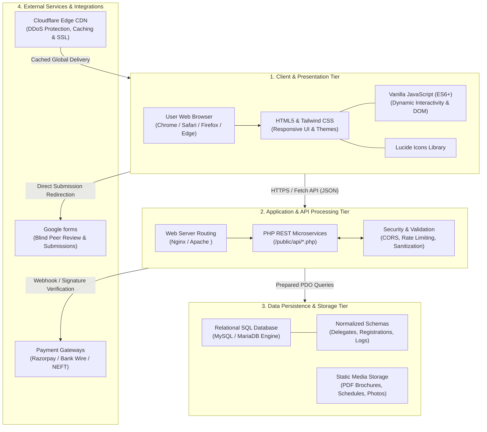

# DYUTI 2027 — National Conference 

The official modern web platform for **DYUTI 2027**, the 27th Annual National Academic Conference hosted by the **Department of Social Work**, [Rajagiri College of Social Sciences (Autonomous)](https://rcss.rajagiri.edu), Kalamassery, Kochi, Kerala, India.

---

## 🌟 Overview

**DYUTI** (*Developmental Yearnings for a United and Transformed India* — meaning *"Spark of Life"*) is a prestigious annual national symposium convened continuously since 1998. The 2027 edition focuses on **"Social Work for Sustainable Development: Empowering Communities through Innovation, Inclusion, and Partnership"**, bringing together scholars, researchers, development practitioners, and policy leaders aligned with the United Nations 2030 Agenda for Sustainable Development (UN SDGs).

This platform serves as the primary delegate and scholar portal, managing academic calls for papers, track explorations, registration advisories, hotel bookings, route navigation, historical conference archives, organizing committee profiles, and direct secretariat inquiries.

---

## ✨ Key Features & Architecture

- **Static HTML5 & Tailwind CSS**: Built with semantic HTML5 and Utility-First Tailwind CSS for ultra-fast static web hosting. Zero Node.js runtime required for production deployment (runs directly on Vercel, GitHub Pages, Apache, Nginx, or IIS).
- **Solid Royal Blue & Gold Navigation Capsule**: High-contrast, stadium-pill floating header with gold active indicators, circular emblem housing, and real-time marquee announcement banner.
- **Background & UN 2030 Agenda Explorer**: Dedicated 3-card grid highlighting Global Commitment & 2030 Agenda, Challenges & Complexities in India, and Coordinated Multi-Stakeholder Action.
- **8 Major Sub-Themes & 45 Sub-Bullet Topics**: Complete research tracks spanning Social Work & SDGs, Inclusive Communities, Digital Innovation, Environmental Justice, Health & Mental Well-being, Quality Education, Policy Governance, and Multi-Sectoral Partnerships.
- **Road to DYUTI 2027 Timeline**: High-visibility multi-layer milestone highway tracking important conference dates and active submission steps.
- **Symmetrical Host Institution & SDG Explorer**: Balanced, fixed-dimension tabs showcasing Rajagiri's legacy (NAAC A++, NIRF #12) and Times Higher Education Global SDG 3 Impact Rankings (Band 601–800).
- **Call for Papers & Submission Guidelines**: Full submission criteria for Oral and Poster presentations, Scopus publication opportunities, and direct integration with Microsoft CMT.
- **Organizing Committee Governance**: Dedicated governance directory presenting 16 distinguished executive and organizing committee faculty members in exact protocol order.
- **Accommodation & Hospitality Directory**: Curated stay zones (Kalamassery, Edappally, Kakkanad) with downloadable PDF contact directories.
- **Travel & Interactive Venue Directions**: Detailed transit routes from Cochin International Airport (COK) and Ernakulam South Railway Station with embedded Google Maps.
- **Regional Sights & Attractions**: Tourist destinations around Kochi and Kerala with verified external guides.
- **Historical Photo Gallery & Lightbox**: Interactive retrospective gallery spanning 25+ conference editions with filtering controls and an accessible image lightbox viewer.
- **Interactive Multi-Step Registration Portal**: Live delegate fee calculator, payment mode selector (Online / Bank Wire), and automated receipt generator.

---

## 🎨 Design System & Color Palette

The DYUTI 2027 visual identity follows a **"Navy, Gold & Ivory"** aesthetic representing academic authority, trust, and the vibrant *Spark of Life*:

| Color Name | Hex Code | Role & Usage on the Platform |
| :--- | :--- | :--- |
| **Heritage Navy Blue** | `#071A33` | **Primary Brand Tone** — Main navigation bar, hero container cards, and page footers. |
| **Royal Ocean Blue** | `#0A2540` &ndash; `#123962` | **Depth & Gradient Accent** — Illuminated gradients in navigation bars and asymmetric cards. |
| **Luminous DYUTI Gold** | `#D4AF37` | **Primary Accent Tone** — Active navigation links, key highlights, dates, and subtitle badges. |
| **Warm Amber** | `#F7C948` / `#FBBF24` | **Call-to-Action (CTA)** — `REGISTER ONLINE` buttons, active timeline milestones, and ranking cards. |
| **Editorial Warm Cream** | `#FDFBF7` | **Page Canvas Background** — Soft ivory/linen background for reading comfort and high-end feel. |
| **Pristine White** | `#FFFFFF` | **Surface & High Contrast** — Card surfaces, logos, and badge containers. |
| **Slate Charcoal** | `#1E293B` / `#0F172A` | **Typography Text Color** — High-contrast text on light backgrounds. |

---

## 💻 Technologies Used

- **Markup & Structure**: **HTML5** (Semantic elements, accessible ARIA attributes, responsive viewport metadata, and SEO optimizations).
- **Styling & Design System**: **Tailwind CSS v3** (Utility-first framework with custom HSL/Hex color tokens, dark glassmorphism gradients, and mobile-first responsive breakpoints) & **Vanilla CSS** for custom keyframe animations.
- **Client-Side Logic & Interactivity**: **Vanilla JavaScript (ES6+)** (Dynamic DOM manipulation, team category filters, interactive tab sliders, modal lightboxes, multi-step registration forms, and clipboard handlers).
- **Typography**: Google Fonts — [Outfit](https://fonts.google.com/specimen/Outfit) (Geometric sans-serif for editorial headings) & modern system sans-serif typography stack.
- **Iconography & Graphics**: **SVG Vector Graphics** & optimized WebP/PNG high-resolution visual assets.
- **Hosting & Infrastructure**: **Static Web Architecture** — Zero Node.js backend required for production; deploys seamlessly to Vercel, Netlify, GitHub Pages, Apache, Nginx, or IIS.

---

## 🏛️ System Architecture

The DYUTI 2027 platform is engineered using a decoupled, high-performance **4-Tier Architecture** separating the client experience, API services, data persistence, and external academic integrations:




### Architecture Layer Summary

| Tier | Primary Role | Technologies & Components |
| :--- | :--- | :--- |
| **1. Client Tier** | Presentation, Accessibility & Dynamic UI | Semantic HTML5, Tailwind CSS v3, Vanilla JS (ES6+), Lucide Icons |
| **2. Application Tier** | Request Validation & REST Routing | Nginx/Apache Web Server, PHP Microservices (`/public/api/`), Rate Limiting |
| **3. Data Tier** | Persistent Storage & Media Assets | Relational SQL (MySQL/MariaDB), Normalized Tables, Local Object/Static Storage |
| **4. External Services** | Specialized Academic & Financial Integrations | Microsoft CMT (Peer Review), Payment Gateways (Razorpay/Bank Wire), Cloudflare CDN |

---

## 📂 Project Structure

```
new website/
├── 404.html               # 404 Custom Error Page
├── accommodation.html     # Delegate Hotels & Accommodation Directory
├── attractions.html       # Kochi Sightseeing & Regional Attractions Guide
├── call-for-papers.html   # Call for Papers, Sub-Themes & CMT Guidelines
├── contact.html           # Secretariat Contacts & Inquiry Desk Form
├── gallery.html           # Historical Conference Photo Archive & Lightbox
├── index.html             # Main Editorial Homepage, Background & Major Sub-Themes
├── our-team.html          # Executive & Organizing Committee Directory (16 Members)
├── rajagiri.html          # Host Institution Profile, NAAC A++ & UN SDG Impact
├── registration.html      # Multi-Step Delegate Registration Portal
├── travel.html            # Route Directions, Airport/Railway Transit & Venue Map
├── js/
│   └── app.js             # Interactive JavaScript Controller (Filters, Forms, Modals)
├── css/
│   └── custom.css         # Tailwind & Custom Vanilla CSS Utilities
├── images/                # High-resolution logos, banners, campus photos & faculty portraits
└── package.json           # Local server preview scripts
```

---

## 🛠️ Local Execution & Hosting

### Option A: Static Preview (Recommended)
Because the application is static HTML5 & JavaScript, you can open `index.html` directly in any web browser, or serve it using Python's built-in HTTP server:

```bash
# Start a local static server on Port 3000
python -m http.server 3000
```
Then visit `http://localhost:3000`.

### Option B: Serve via Node.js
If you have Node.js installed, you can launch a local web server:

```bash
# Serve static files locally
npx serve .
```

---

## 📄 License & Attribution

&copy; 2026–2027 **Rajagiri College of Social Sciences (Autonomous)** &bull; Department of Social Work. All Rights Reserved.
