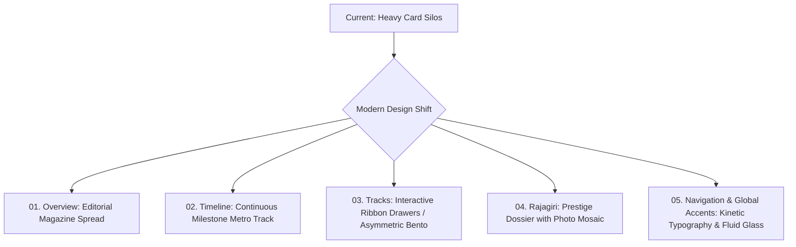

 DYUTI 2027 — UI/UX Design Audit & Next-Level Visual Architecture Report

---

## 1. Executive Summary: The "Card Fatigue" Problem

The current **DYUTI 2027** website is cleanly structured, fast, and responsive. However, it relies predominantly on a single UI pattern across almost every section: **encapsulated, uniform card containers** (asymmetric curved leaf cards, bordered rounded rectangles, and multi-column card grids).

### Why the Current Design Feels "Full of Cards"
1. **Container Overuse**: Important narrative text, lists, timelines, statistics, themes, awards, and forms are all individually wrapped in high-contrast card boxes (navy `#071A33` or white with borders).
2. **Predictable Rhythms**: Scrolling down the page presents:
   - *Overview*: 3 large stacked navy curved cards.
   - *Timeline*: 5 boxed leaf cards with top step squares.
   - *Tracks*: 8 identical navy leaf cards in a 4-column grid.
   - *Rajagiri Page*: 4-card recognition grids, 3-card SDG grids, and 4-column metric grids.
3. **Loss of Hierarchy**: When every piece of information is treated as a card of equal weight, nothing stands out as the primary visual hero.
4. **Lack of Fluidity**: Cards create artificial visual boundaries, preventing the user's eye from moving naturally through a cohesive editorial story.

---

## 2. Current Website Architecture & Design System

| Dimension | Current Implementation |
| :--- | :--- |
| **Tech Stack** | React 18, Vite, TypeScript, Tailwind CSS, Lucide Icons, React Router |
| **Color Palette** | **Primary:** Deep Midnight Navy (`#071A33`)<br>**Secondary / Accent:** Warm Golden Amber (`#F59E0B` / `amber-300`/`400`)<br>**Base Canvas:** Warm Off-White / Alabaster (`#FDFBF7`)<br>**Card Gradients:** `from-[#071A33] via-[#0e2a52] to-[#040e1c]` |
| **Typography** | **Headings:** DM Sans / Plus Jakarta Sans (ExtraBold/Black)<br>**Body:** Inter / DM Sans (Medium 400/500)<br>**Labels & Accents:** Monospace (`font-mono`) uppercase tracking |
| **Current Layout Rhythm** | **Hero** $\rightarrow$ **Overview Cards** $\rightarrow$ **Timeline Grid Cards** $\rightarrow$ **Sub-Theme 8-Card Grid** $\rightarrow$ **Footer** |

---

## 3. Five Next-Level Design Concepts (Moving Beyond Cards)

### Concept A: High-End Swiss Academic Editorial (Monocle / Harvard Gazette Style)
* **Visual Identity**: Magazine-grade editorial layout with bold headline typography, fine hairline dividers (`h-px border-slate-250`), dynamic multi-column flows, and large numeral typography (`01`, `02`, `03`).
* **Why it works**: Replaces heavy boxy cards with elegant white space, subtle background tonal shifts, and typography-driven hierarchy. Information breathes and feels prestigious.
* **Key Elements**:
  - Full-width quote highlights with subtle serif accents.
  - Numbered list streams separated by hairline rules instead of card boxes.
  - Asymmetric 2-column and 3-column editorial text layouts.

### Concept B: Interactive Scrollytelling & Split-Pane Canvas
* **Visual Identity**: Sticky, pinned left sidebar (showing the active section, theme title, or milestone) while the right side smoothly scrolls through interactive content ribbons.
* **Why it works**: Eliminates the feeling of scrolling through endless static cards by creating an engaging interactive two-panel reading experience.
* **Key Elements**:
  - Pinned timeline stepper on the left with expanding milestone details on the right.
  - Live interactive topic filtering where clicking a category instantly highlights topic tags dynamically.

### Concept C: Modern Asymmetrical Bento Grid with Interactive Depth
* **Visual Identity**: Instead of 8 identical boxes, arrange content in an **asymmetric bento matrix** with varying aspect ratios (e.g., 1 featured super-wide showcase + 2 compact live stats + 1 interactive graphic widget).
* **Why it works**: Creates natural visual pacing, breaks monotony, and guides the user's focus to the most critical information first.
* **Key Elements**:
  - Glassmorphic depth layers with ambient background blur.
  - Micro-interactions on hover (expandable preview drawers, subtle glow reflections).

### Concept D: Expandable Ribbon Drawers / Horizontal Interactive Trays
* **Visual Identity**: Collapsible, ultra-sleek horizontal accordion trays with large typographic numbering and hover/click slide-out disclosures for topics.
* **Why it works**: Condenses 8 bulky track cards into a sophisticated, space-efficient directory that feels like an interactive academic syllabus.

### Concept E: Continuous Milestone Metro / Subway Ribbon
* **Visual Identity**: A continuous, connected milestone path with clean timeline pins, live date badges, and progress status pills, rather than individual card silos.
* **Why it works**: Unifies the submission and conference dates into a singular journey.

---

## 4. Section-by-Section Redesign Roadmap



### 1. Conference Overview & Theme Narrative
* **Current**: 2 stacked large dark-navy leaf-shaped cards.
* **Next-Level Redesign**:
  - Transform into a **wide editorial magazine spread**.
  - Large display headline with prominent quote marks.
  - Side-by-side 2-column text with floating emblem artwork and highlight callout boxes without heavy container borders.

### 2. The Road to DYUTI 2027 (Timeline)
* **Current**: 5 boxed leaf cards with step badges.
* **Next-Level Redesign**:
  - A sleek **horizontal milestone ribbon** where clicking or hovering a date expands a clean drawer below.
  - Direct visual connection lines showing progression from *Registration Opens* $\rightarrow$ *Abstract Submission* $\rightarrow$ *Review* $\rightarrow$ *Final Paper* $\rightarrow$ *Conference*.

### 3. Thematic Areas & Focus Tracks
* **Current**: 8 identical rectangular curved cards in a 4x2 grid.
* **Next-Level Redesign**:
  - **Option 1 (Editorial Directory)**: 2-column numbered list with expandable topic pill tags and live keyword search.
  - **Option 2 (Interactive Bento)**: Highlight the top 3 flagship tracks with rich visuals and present remaining tracks in a clean horizontal slide carousel or interactive drawer.

### 4. Rajagiri Institution & 25 Years Milestone
* **Current**: 4-box award grid, 3-box SDG grid, and 4-box international metrics.
* **Next-Level Redesign**:
  - A **Prestige Dossier** featuring an authentic photo mosaic, floating stat badges (`#2 in India`, `NAAC A++ 3.83`, `60+ Global MoUs`), and a continuous story stream.

---

## 5. Ready-to-Paste ChatGPT Prompt

You can copy and paste the prompt below directly into **ChatGPT** to brainstorm further concepts and get specialized design suggestions:

```markdown
You are an elite Creative Director and Principal UI/UX Architect specializing in modern academic, research, and high-prestige conference websites (comparable to Harvard, MIT Media Lab, Monocle, and Apple Keynote event portals).

I need your creative recommendations and design ideas to elevate an academic conference website called "DYUTI 2027" (26th National Conference on Social Work for Sustainable Development at Rajagiri College of Social Sciences, Kochi, India).

### 🔍 Current Website Context:
- Tech Stack: React 18, Vite, TypeScript, Tailwind CSS, Lucide Icons.
- Color Palette: Deep Midnight Navy (#071A33), Warm Golden Amber (#F59E0B / amber-300), Warm Alabaster/Off-White (#FDFBF7), Crisp White (#FFFFFF).
- Typography: DM Sans / Plus Jakarta Sans (Headings), Inter (Body), Monospace (Accents).

### ⚠️ The Problem with the Current Design:
The website currently suffers from severe "CARD FATIGUE". Almost every single section consists of heavy, boxed rectangular/curved cards:
1. Overview: 2 large stacked dark navy cards.
2. Timeline: 5 boxed leaf-shaped cards with top step squares.
3. Thematic Areas: 8 identical navy curved cards in a 4-column grid.
4. Rajagiri Page: 4-card award grids, 3-card SDG grids, and boxy metric containers.

The layout feels predictable, container-heavy, and rigid. It lacks fluid editorial storytelling, visual breathing room, dynamic hierarchy, and modern micro-interactions.

### 🎯 What I Need From You:
1. Propose 3 distinct, cutting-edge visual concepts (e.g., Swiss Editorial, Scrollytelling Magazine, Interactive Asymmetric Bento, Ribbon Drawer System) that move away from generic boxy cards.
2. Provide specific redesign ideas for these 4 sections:
   - Section 1: The Conference Overview & Heritage (Deliberating Sustainable Development + DYUTI history)
   - Section 2: Important Dates & Deadlines (The Road to DYUTI 2027)
   - Section 3: The 8 Thematic Areas & Focus Tracks (Currently 8 cards)
   - Section 4: Rajagiri Institution & 25 Years of Internationalisation Milestone
3. For each proposed section, describe the layout structure, visual hierarchy, typography treatments, and interactive hover/motion states using Tailwind CSS classes and modern UI patterns.
4. Suggest layout techniques (e.g., negative space, hairline dividers, typography scale contrast, sticky sidebars, interactive drawers) to make the conference look like a world-class, premium international academic symposium.
```
