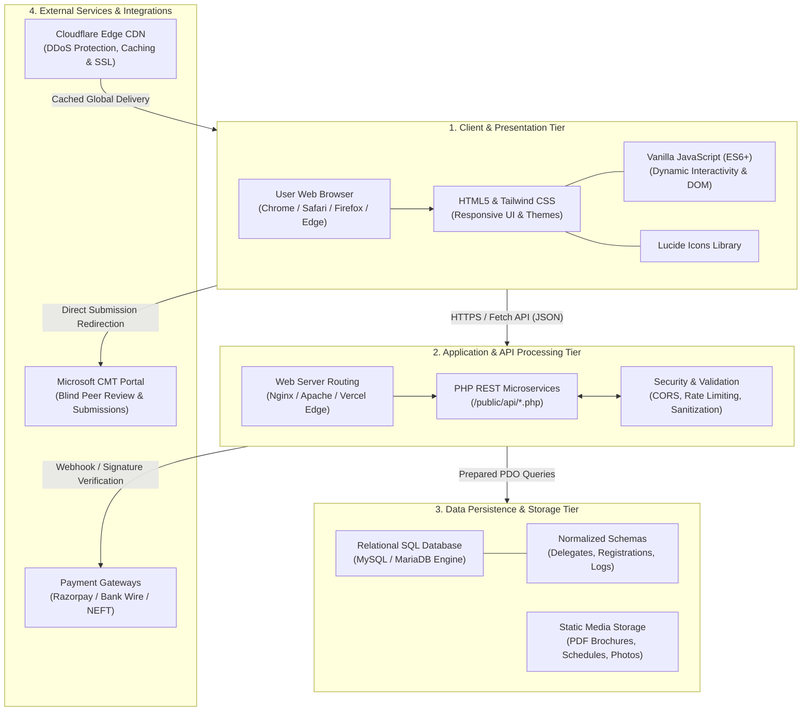

# 🏛️ System Architecture — DYUTI 2027

The **DYUTI 2027 Academic Conference Web Platform** is engineered using a decoupled, high-performance **4-Tier Architecture** that separates presentation, application logic, data persistence, and external academic integrations.

---

## 📊 System Architecture Diagram

---

## 🧱 Architectural Layers & Components

### 1. Client & Presentation Tier (Frontend)
- **Modern Web Browsers:** Desktop, tablet, and smartphone compatibility (Chrome, Safari, Firefox, Edge).
- **HTML5 Semantic Structure:** Accessible ARIA attributes, structured metadata, and responsive viewports.
- **Tailwind CSS v3:** Custom HSL/Hex design tokens implementing the Royal Navy (`#071A33`), DYUTI Gold (`#D4AF37`), and Warm Ivory (`#FDFBF7`) visual palette.
- **Vanilla JavaScript (ES6+):** Lightweight client-side engine powering interactive fee calculators, photo gallery lightboxes, organizing committee filters, and asynchronous form handling without heavy framework overhead.

### 2. Application & API Processing Tier (Backend & Middleware)
- **Web Server Routing:** Nginx / Apache / Vercel Edge routing with automated SSL/TLS termination.
- **PHP REST Microservices:** Modular, stateless endpoints (`/public/api/`) handling registrations and contact inquiries.
- **Security Middleware:** Strict CORS headers, payload sanitization to mitigate XSS/SQLi, and rate limiting against automated spam.

### 3. Data Persistence & Storage Tier
- **Relational SQL Database:** MySQL/MariaDB backing ACID-compliant transactions for delegate pass reservations.
- **Normalized Schemas:** Segregated tables for delegates, pass tiers, transaction logs, and audit trails.
- **Static Media Repository:** Optimized local and CDN-backed storage for downloadable brochures, presentation schedules, and historical symposium photo archives.

### 4. External Services & Integrations
- **Microsoft CMT (Conference Management Toolkit):** Dedicated external portal managing the double-blind peer review lifecycle, reviewer scoring, and author camera-ready revisions.
- **Payment Gateways:** Razorpay / Stripe online payment gateways with cryptographic webhook signature verification, alongside offline bank wire (NEFT/RTGS) reconciliation.
- **Cloudflare Edge CDN:** Globally distributed Anycast CDN nodes providing DDoS mitigation, Web Application Firewall (WAF), and edge caching for sub-second global response times.
